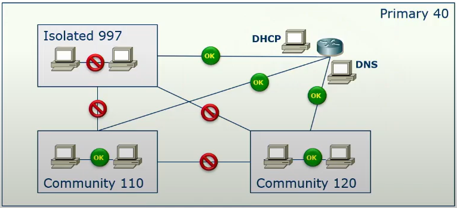
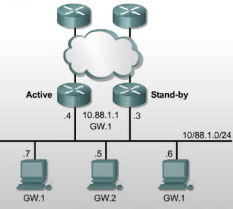

# Prywatne VLANy
Sieci tego samego typu należy budować na switchach należących do tej samej 'klasy zaufania'
- sieci zaufane łączymy na 'zaufanym' switchu 
- sieci strefy DMZ łączymy na switchu DMZ,
- sieci niezaufane na 'niezaufanym' switchu 

### Ewolucja rozwiązań:
- protected port (private VLAN edge) - port nalezy do VLAN, ale nie może komunikować się z innym zabezpieczonym portem brzegowym 

- private VLAN - wewnątrz podstawowej sieci VLAN (primary) definiujemy pod-VLANy: isolated (jeden), community (może być wiele). Porty promiscuous - jawne, dostępne porty (każdy może się z nimi komunikować)


W prywatnych VLANach wszystkie hosty należą do tej samej podsieci IP.

- Primary VLAN – główny VLAN
- Isolated VLAN – porty, które nie mogą się komunikować z nikim, tylko z promiscuous portem
- Community VLAN – porty mogą rozmawiać między sobą i z promiscuous portem

Promiscuous port – może rozmawiać ze wszystkimi (np. router, firewall)

# Hot Standby Routing Protocol (HSRP)



Jest to tzw. wirtualny router z wirtualnym adresem MAC. W przypadku awarii jednego routera, drugi router przejmuje tą wirtualną adresację. Musi także powiadomić switche, aby te zaaktualizowały swoje tablice FDB (gratuitous ARP). 

Działanie:

1. Routery dołączają do wspólnej grupy HSRP
2. Konfigurują wspólne wirtualne IP, które będzie bramą domyślną dla hostów. Jest też wirtualny MAC. 
3. Jeden zostaje `Active Router`, drugi to `Standby Router`. 

`https://netadminpro.pl/konfiguracja-protokolu-hsrp/`

```cisco
R(config-if) #standby 50 ip 10.1.1.1 // udawaj router o danym ip
R(config-if) #standby 50 priority 95 
R(config-if) #standby 50 preempt // możliwość wywłaszczenia 
R(config-if) #standby 50 timers 3 10 // co 3 sek., ważność 10 sek.
R(config-if) #standby 50 track f0/1 10 

R#show standby [brief]
R#debug standby 
```
Należy wyłączyć ICMP Redirect 

